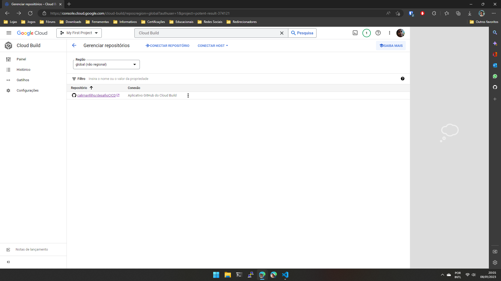
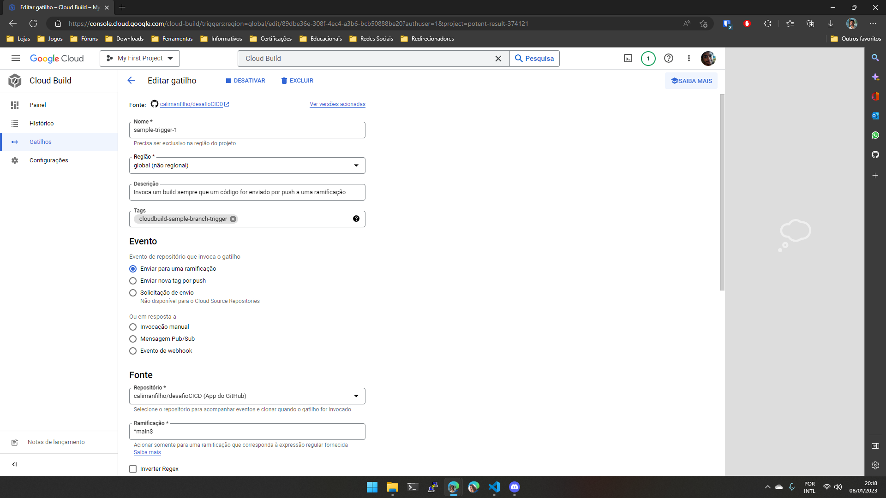
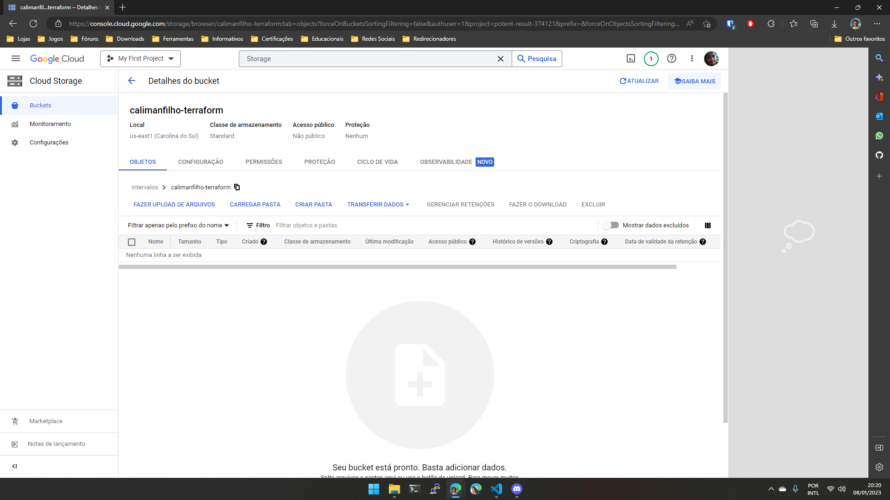

# Desafio Criando um Pipeline de CI/CD

Neste projeto, será implementado um Pipeline de CI/CD fazendo uso do Cloud Build e Terraform. Todo o procedimento será descrito abaixo, com os _prints_ de cada etapa.

1. Foi realizado o clone do diretório do repositório do desafio da DIO, [terraform-exemplo2](https://github.com/digitalinnovationone/terraform-gcp/tree/main/terraform-exemplo2), para o repositório [atual](https://github.com/calimanfilho/desafioCICD), para que seja configurado a _trigger_ do Cloud Build.

2. Agora o Cloud Build deverá ser aberto, para que seja conectado o repositório [atual](https://github.com/calimanfilho/desafioCICD) no Cloud Build 

    

3. Após a configuração do repositório deverá ser criado o gatilho para invocar um _build_ sempre que um código for enviado por _push_ a uma ramificação no repositório atual, sendo executado automaticamente o [cloudbuild.yaml](cloudbuild.yaml), que fará um `terraform apply`.

    

4. Também será criado um bucket chamado de `calimanfilho-terraform` na zona `us-east1`, mesmo local que será criado a VM, para que os arquivos de estado do Terraform seja salvo no Google Cloud Storage.

    

5. Para o estado ser salvo, é necessário incluir o código abaixo no [main.tf](terraform-challenge/main.tf), informando o nome do bucket criado anteriormente, no argumento `bucket`.

    ```bash
    backend "gcs" {
        bucket  = "calimanfilho-terraform"
        prefix  = "terraform/state"
    }
    ```

6. Para testar, será modificado no [main.tf](main.tf), o argumento `name` do recurso `google_compute_instance.vm_instance` será alterando de `terraform-instance` para `cloudbuild-terraform`.